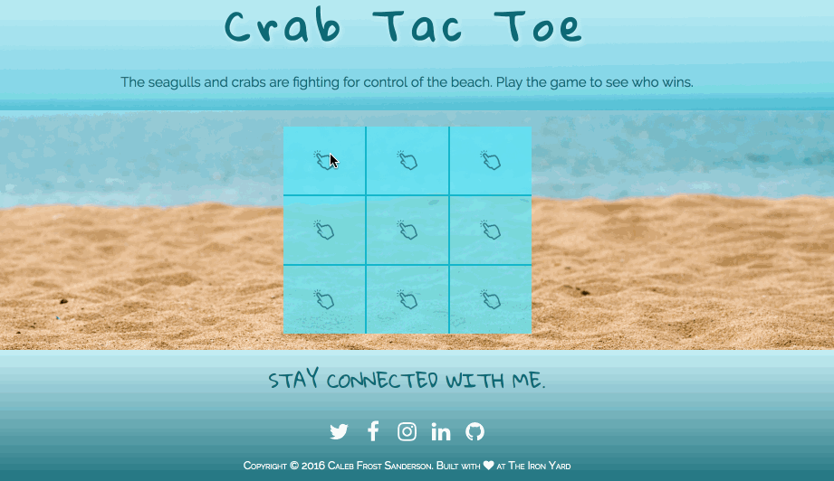

# [Crab-Tac-Toe](http://tic-tac-toe.cfsanderson.surge.sh)

My family and I eat at the Anna Maria Oyster Bar for lunch nearly every Sunday. One of our favorite things to do is play tic-tac-toe while we wait for our food. I styled this version to match the beachy theme of the restaurant. Now we play this instead of wasting napkins.

Although this turned into a fun family project, it started out as part of my coursework at [Suncoast Developers Guild](https://suncoast.io/) in fall of 2016. The objective of this assignment was to implement a working app using vanilla Javascript to execute the logic behind the gameplay. Other features include a responsive header and footer and a mobile friendly gameboard. Enjoy!
